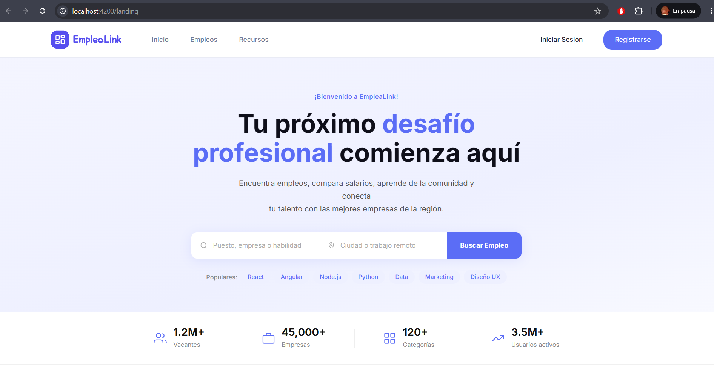
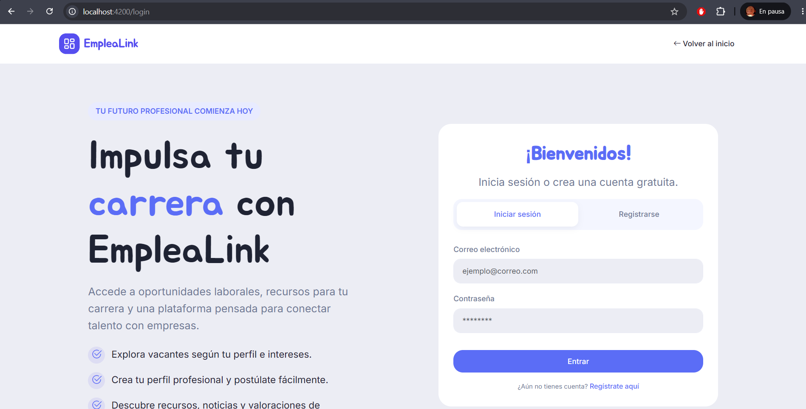

# 💼 EmpleaLink

Plataforma web de búsqueda y gestión de empleo desarrollada con Angular y PostgreSQL, diseñada para conectar empresas y candidatos mediante la publicación de vacantes, aplicaciones laborales e interacción entre usuarios.

El proyecto fue desarrollado como parte de una iniciativa académica para aplicar conocimientos de desarrollo web moderno, integración con APIs REST y trabajo colaborativo.

---

## 🚀 Características Principales

* Registro e inicio de sesión de usuarios.
* Gestión de perfiles profesionales.
* Publicación y administración de vacantes.
* Aplicación a ofertas de empleo.
* Sistema de roles (Administrador, Empresa y Usuario).
* Foro interactivo para la comunidad.
* Sistema de notificaciones.
* Valoraciones y comentarios sobre empresas.
* Consumo de API REST para gestión de datos.
* Interfaz responsive desarrollada con Angular.

---

## 🛠️ Tecnologías Utilizadas

### Frontend

* Angular
* TypeScript
* HTML5
* CSS3
* Bootstrap

### Backend

* Node.js
* Express.js
* REST API

### Base de Datos

* PostgreSQL

### Herramientas

* Git
* GitHub
* Postman

---

## 👥 Equipo de Desarrollo

Proyecto desarrollado en colaboración por estudiantes de Ingeniería en Sistemas.

### Mi Participación (Douglas León)

* Creación y organización inicial de la estructura del proyecto Angular.
* Planificación y distribución de tareas entre los integrantes.
* Desarrollo de funcionalidades frontend.
* Integración de módulos desarrollados por el equipo.
* Consumo e integración de servicios REST.
* Corrección de errores y pruebas funcionales.
* Coordinación del proceso de integración del sistema.
* Apoyo en el diseño y validación de funcionalidades.

---

## 📌 Estado del Proyecto

Proyecto académico finalizado.

Actualmente el repositorio contiene únicamente el frontend Angular. Algunas funcionalidades requieren la ejecución de la API backend y la base de datos PostgreSQL para su visualización completa.

---

## 📷 Capturas del Sistema

### Landing Page



### Inicio de Sesión




> Actualmente las capturas de módulos internos no se encuentran disponibles debido a que requieren la ejecución conjunta del frontend y la API backend. Serán agregadas en futuras actualizaciones del repositorio.

---

## ⚙️ Requisitos

* Node.js
* Angular CLI
* PostgreSQL
* API Backend de EmpleaLink

---

## 🔧 Instalación

Clonar el repositorio:

```bash
git clone https://github.com/Douglas0625/EmpleaLink_Angular.git
```

Instalar dependencias:

```bash
npm install
```

Ejecutar la aplicación:

```bash
ng serve
```

La aplicación estará disponible en:

```text
http://localhost:4200
```

---

## 🎯 Objetivos de Aprendizaje

Este proyecto permitió aplicar conocimientos relacionados con:

* Desarrollo Frontend con Angular.
* Consumo de APIs REST.
* Arquitectura cliente-servidor.
* Manejo de roles y permisos.
* Diseño de interfaces web.
* Integración de sistemas.
* Trabajo colaborativo utilizando Git y GitHub.

---

## 🔮 Mejoras Futuras

* Implementación de autenticación mediante JWT.
* Cifrado seguro de contraseñas utilizando bcrypt.
* Protección avanzada de rutas.
* Validaciones más específicas para manejo de errores.
* Despliegue en entorno productivo.
* Optimización de rendimiento y escalabilidad.
